# Sensor DHT22 com ESP32 - MQTT | Node-Red - Dashboard | MQTT - ESP32 com LEDs

## Descrição
Este projeto faz parte do curso de Disruptive Architectures da FIAP. O objetivo é desenvolver duas placas que comunicam com um servidor MQTT e traga as informações no Node-Red.

## Link do Vídeo - Aplicação Funcional

[Vídeo Sensor DHT22 com Placa ESP32 - MQTT | Node-Red - Dashboard | MQTT - Placa ESP32 com LEDs](https://youtube.com)

- [Sensor DHT22 com Placa ESP32 no Wokwi](https://wokwi.com/projects/412122109943784449)
- [Placa ESP32 com 06 LEDs no Wokwi](https://wokwi.com/projects/412299204852146177)

## Integrantes do Grupo
- **Nome**: Guilherme Dias Gomes - **RM99577** 
- **Nome**: Guilherme Rocha Toledo dos Santos - **RM99396** 
- **Nome**: Hemily Nara da Silva - **RM550889** 
- **Nome**: Kaique Santos de Andrade - **RM99562**
- **Nome**: Isadora Tatajuba Moreira Pinto - **RM552522**
- **Nome**: Marcelo Augusto de Mello Paixão - **RM99466**
- **Nome**: Maria Eduarda Sousa de Oliveira - **RM552477** 
- **Nome**: Matheus Wasserman Fernandes Silva - **RM550712** 
- **Nome**: Michael José Bernardi da Silva - **RM99409** 
- **Nome**: Rodrigo Batista Freire - **RM99513**

## Desenho de Arquitetura


## Como funciona o projeto?
Criamos uma placa ESP32 no Wokwi que recebe os dados de Temperatura e Umidade do sensor DHT22 da seguinte forma,

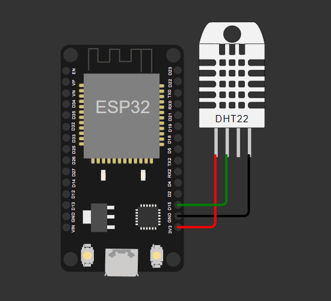

[ESP32 com DHT22 criado no Wokwi](https://wokwi.com/projects/412122109943784449)

### Bibliotecas utilizadas no Wokwi

- WiFI
- PubSubClient
- DHTesp

Esta placa tem como finalidade enviar as informações do Sensor para o Servidor MQTT da Azure.

---

Com isto, criamos outra placa ESP32 no Wokwi com uma Breadboard que há 6 LEDs diferentes conectados nela da seguinte forma, 

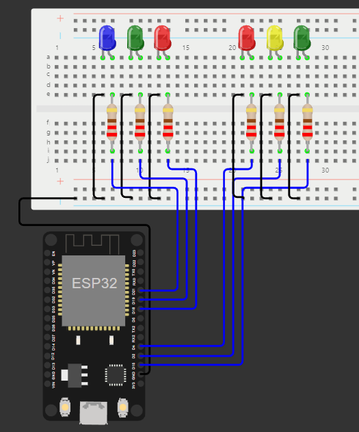

[ESP32 com os 6 LEDs criado no Wokwi](https://wokwi.com/projects/412299204852146177)

3 LEDs para Temperatura:
- Azul (Temperatura abaixo de 18 ºC) - Frio
- Verde (Temperatura maior ou igual a 18 ºC e Menor que 35 ºC) - Razoável
- Vermelho (Temperatura maior ou igual a 35 ºC) - Calor

3 LEDs para Umidade:
- Vermelho (Umidade menor que 50%) - Seco | Pouco Umido
- Amarelo (Umidade maior ou igual a 50% e menor que 100%) - Umido
- Verde (Umidade maior ou igual a 100%) - Bastante Umido

### Bibliotecas utilizadas no Wokwi

- WiFI
- PubSubClient

Ao receber o dado do Servidor MQTT a placa irá acionar uma cor de acordo com o tipo e valor dela.

---

##  Dashboard conectado com o Servidor MQTT e Google Sheets no Node-Red

Nesta aplicação o node-red tem que estar instalado para que possa funcionar, siga os passos a seguir

### Instalação do Node-Red (Localmente)

Execute o comando abaixo no terminal de acordo com o seu sistema operacional

<details open>
<summary>Instalação com NPM - Windows</summary>

```
npm install -g --unsafe-perm node-red
```
</details>

<details>
<summary>Instalação com NPM - Linux</summary>

```
sudo npm install -g --unsafe-perm node-red
```
</details>

---

Após a instalação execute o seguinte comando para inicializar:
```
node-red start
```

[mais opções para rodar o node-red](https://nodered.org/docs/getting-started/)

---

Abra uma guia no navegador e coloque a url do servidor node-red que irá aparecer no terminal:

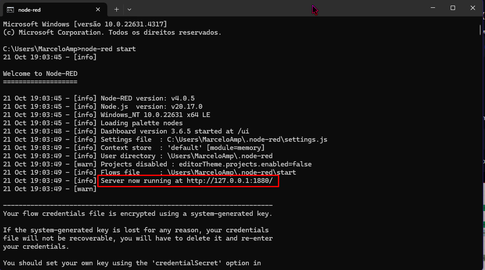

Abra o menu do lado superior direito e clique em Manage Palette


---

### Instale as bibliotecas necessárias:

- node-red-dashboard
- node-red-contrib-google-sheets

Pesquise as bibliotecas acima na aba Install

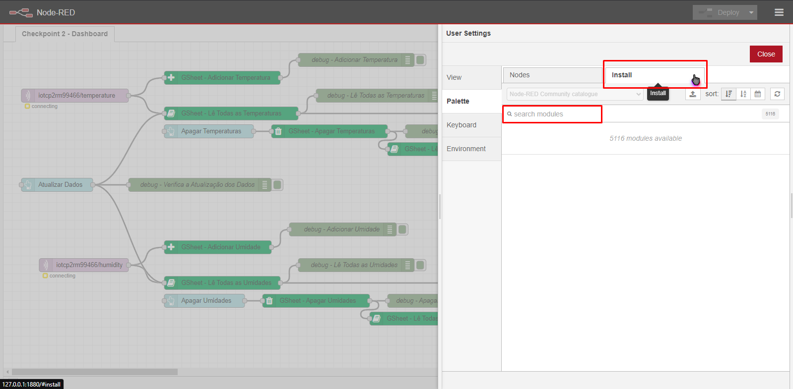

---

### Configuração do Servidor MQTT na Azure, Dashboard e Google Sheets

O Servidor MQTT já está configurado,

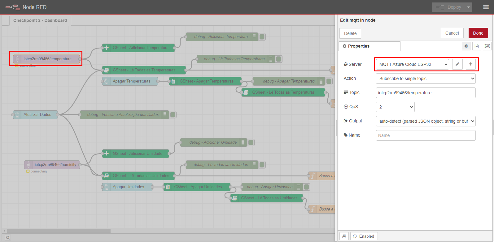

### Como foi criado o Servidor MQTT na Azure?

Siga o video e os comandos a seguir,

[Como subir um MQTT Broker na Azure com máquina virtual](https://youtu.be/8WK06iuX0kA)

[Passo a Passo da instalação do Mosquitto MQTT Broken no Linux](http://www.steves-internet-guide.com/install-mosquitto-linux/)

Permita a execução do Mosquitto em acesso remoto, execute o comando abaixo,

```
sudo nano /etc/mosquitto/mosquitto.conf
```

Adicione as seguintes linhas no arquivo:

```
listener 1883
allow_anonymous true
```

Execute a aplicação com o seguinte comando,

```
mosquitto
```

Em caso de erro na execução por já existir portas utilizadas execute o comando abaixo e após isso tente o anterior novamente,

```
sudo service mosquitto stop
```

---

### Dashboard

Abra os dashboards e clique em Done para reconhecer as configurações feitas

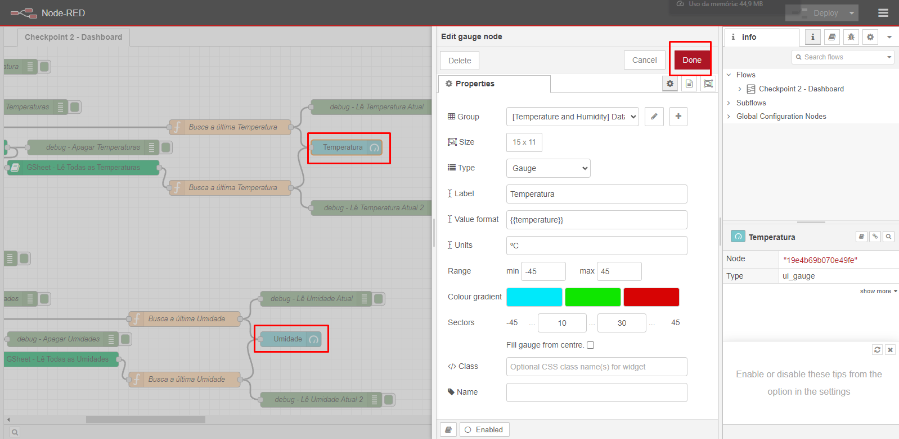

---

### Google Sheets

Clique em configurações no ícone de engrenagem
<br>
Verifique se a chave da API do Google está configurado no seguinte

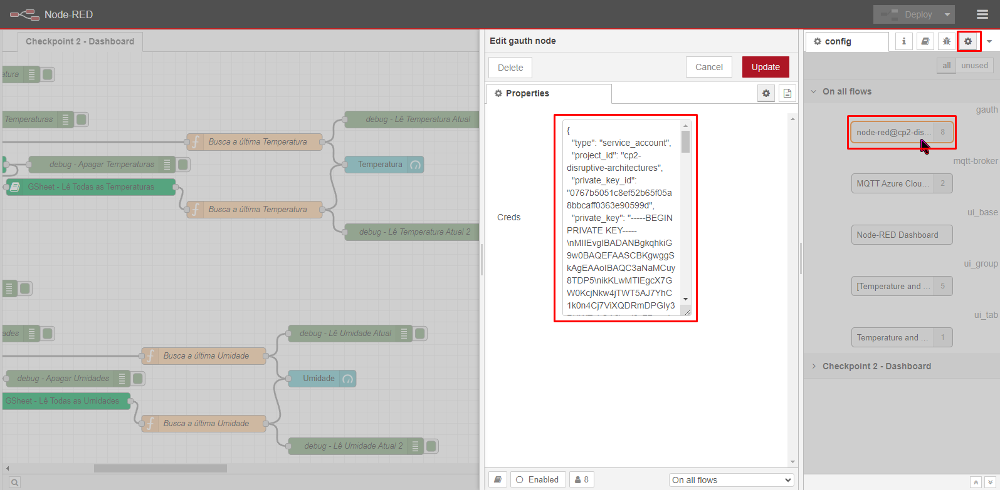

Para utilizar a minha API Key e testar a partir dela entre em contato comigo.

Em caso de dúvidas para criar sua própria planilha no google,
[Conexão do Google Sheets no Node-Red](https://youtu.be/JKh9qn0fxew)

A Planilha tem que estar da seguinte forma,

<details>
<summary>Temperatura</summary>


</details>


<details>
<summary>Umidade</summary>

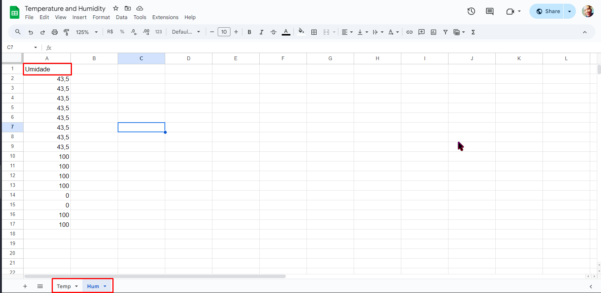
</details>

Obs: [Apenas Visualização dos Dados](https://docs.google.com/spreadsheets/d/11L64-6b8lClQBAOUwdkERVziib225yAC1vHHEeh9ppo/edit?usp=sharing)

---

### Fluxo de Comandos no node-red

A Execução será feita de forma automática assim que estiver tudo configurado corretamente,

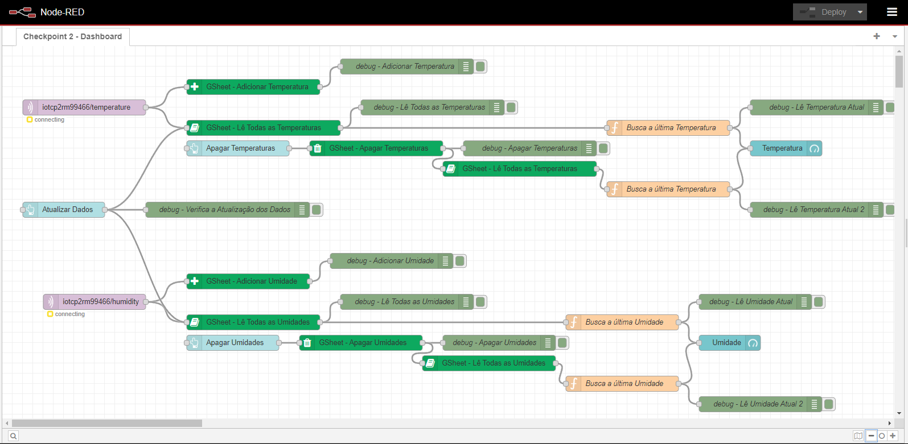

Para que possa verificar o Dashboard, clique na seta pra baixo a seguir

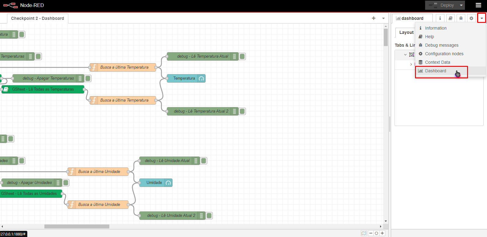

Abra o Dashboard da seguinte maneira,


e o resultado será este,

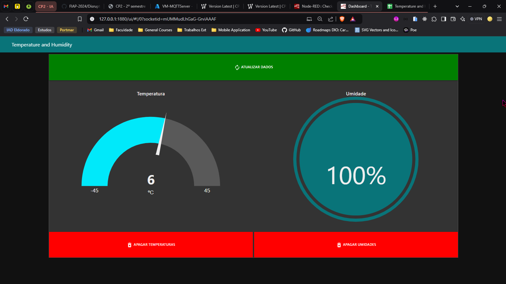

---

Execute as placas no Wokwi, verifique se as placas estão se comunicando e abra o Dashboard para validar os dados.